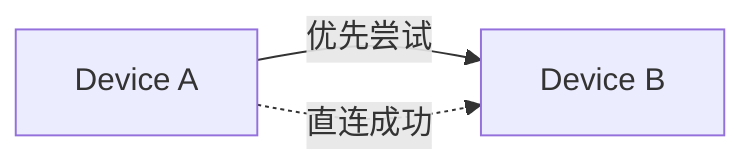
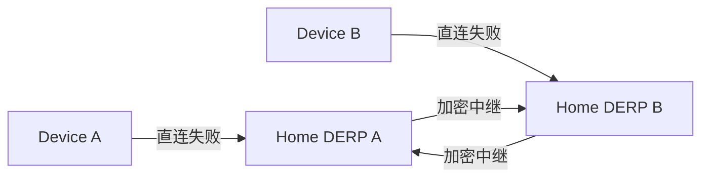
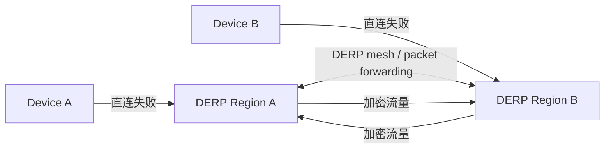

# Tailscale DERP 自建与多 Region 说明

这份笔记记录了一个没有域名、没有公网证书的 Linux 服务器如何作为 Tailscale DERP 使用，以及在 Tailscale 里如何配置自定义 DERP map。

## 1. 服务器侧部署思路

适用场景：

- 只有公网 IP，没有域名
- 没有现成的 HTTPS 证书
- 希望使用 Tailscale 官方 `derper` 二进制
- 通过 `ssh aliyun` 直接管理 Linux 服务器

### 1.1 核心结论

Tailscale 官方 `derper` 支持：

- `--certmode=manual`
- `--hostname` 使用裸 IP
- 自动为该 IP 生成自签证书
- 通过 `sha256-raw:` 指纹在客户端侧做证书绑定

这意味着：  
**没有域名也可以跑自建 DERP。**

### 1.2 服务器启动参数

实际运行时，建议让 `derper` 监听一个非 443 端口，例如：

```bash
/usr/local/bin/derper \
  -c /var/lib/derper/derper.key \
  -a :8443 \
  -http-port -1 \
  -stun-port 3478 \
  -certmode manual \
  -certdir /var/lib/derper/certs \
  -hostname <PUBLIC_IP>
```

说明：

- `-c`：`derper` 自己的配置文件，里面保存节点私钥
- `-a :8443`：HTTPS DERP 端口
- `-http-port -1`：不单独开 HTTP
- `-stun-port 3478`：STUN 端口
- `-certmode manual`：手工证书模式
- `-certdir`：证书目录
- `-hostname`：这里可以直接填公网 IP

### 1.3 `derper` 自签证书的特征

当 `--hostname` 填的是 IP 时，`derper` 会生成自签证书。  
启动日志里会打印类似下面的信息：

```text
Using self-signed certificate for IP address "X.X.X.X"
{"Name":"custom","RegionID":900,"HostName":"X.X.X.X","CertName":"sha256-raw:..."}
```

其中 `CertName` 就是 Tailscale 客户端需要用来校验这个 DERP 节点的指纹。

---

## 2. Tailscale 里的配置方式

Tailscale 里的自定义 DERP 是通过 **tailnet policy file** 的 `derpMap` 配置的。

### 2.1 配置模板

下面是一个可直接参考的模板：

```json
{
  "derpMap": {
    "Regions": {
      "900": {
        "RegionID": 900,
        "RegionCode": "aliyun",
        "RegionName": "Aliyun DERP",
        "Nodes": [
          {
            "Name": "900a",
            "RegionID": 900,
            "HostName": "<PUBLIC_IP>",
            "CertName": "sha256-raw:<CERT_SHA256_RAW>",
            "DERPPort": 8443,
            "STUNPort": 3478
          }
        ]
      }
    }
  }
}
```

### 2.2 字段含义

- `RegionID`
  - 自定义 region 建议使用 `900-999`
  - 这是 Tailscale 预留给用户自建 DERP 的区间

- `RegionCode`
  - 简短代码，例如 `aliyun`

- `RegionName`
  - 人类可读名称，例如 `Aliyun DERP`

- `HostName`
  - 这里可以直接写公网 IP

- `CertName`
  - 自签证书时要填 `sha256-raw:<证书指纹>`

- `DERPPort`
  - 自定义 HTTPS 端口

- `STUNPort`
  - STUN 端口，和服务器一致

### 2.3 在 Tailscale 管理后台怎么填

1. 打开 Tailscale Admin Console
2. 进入 `Access controls` / `Policy file`
3. 把上面的 `derpMap` 合并进现有 policy file
4. 保存并通过校验

注意：

- 这里只是把你的自建 DERP 加进去
- 不会替换默认的官方 DERP
- 客户端会根据可达性和延迟自动选择

---

## 3. Tailscale 如何选择 DERP

Tailscale 客户端一般按下面顺序工作：

1. 优先直连
2. 直连失败时，使用 DERP
3. 先选自己测出来的 home DERP region
4. 如果同一个 tailnet 内有多个 region，客户端会根据延迟和可达性选择更合适的 region

### 3.1 重点理解

**DERP 不是固定绑定某一台。**

每个设备都会自己测延迟，然后选一个最合适的 home DERP。  
所以同一个 tailnet 里的不同设备，可能会连到不同的 DERP region。

### 3.2 直连失败时的路径

- 设备 A 不能直连设备 B
- A 会把加密流量发给自己选中的 DERP
- B 会把流量从自己的 DERP 或可达的 relay 路径接收回来

---

## 4. 多个 DERP Region 时，数据怎么走

这里要分清两层：

### 4.1 客户端层

客户端会根据自己的网络情况选择一个 home DERP region。

### 4.2 服务器层

如果存在多个 DERP server，**它们之间是否会转发**，取决于是否配置了 DERP mesh。

也就是说：

- **只在 policy file 里加多个 DERP region**
  - 客户端可以看见多个 region
  - 客户端可以各自选择不同 region
  - 但自建 DERP 之间不会自动互相 mesh

- **如果要让自建 DERP 之间互相转发**
  - 需要在 `derper` 上额外配置 `--mesh-with`
  - 并配合 `--mesh-psk-file`

### 4.3 结论

**会有跨 DERP region 转发，但前提是服务器之间配置了 mesh。**

如果没有 mesh：

- 客户端可以各自选不同 region
- 但 region 之间不会自动互传包

---

## 5. 转发关系图

### 5.1 单个 tailnet 内：优先直连



### 5.2 直连失败：走 DERP



### 5.3 多个 DERP region + mesh



### 5.4 需要记住的结论

- 设备之间优先直连
- 直连不通才走 DERP
- 一个 tailnet 里不同设备可以选不同 DERP region
- 多个 self-hosted DERP 要互转发，需要额外 mesh 配置

---

## 6. Mac 上怎么测试

### 6.1 看当前网络探测

```bash
tailscale netcheck
```

重点看：

- 是否能看到你的自定义 DERP region
- 延迟是否合理
- 有没有明显的连通性异常

### 6.2 看 Tailscale 状态

```bash
tailscale status
```

### 6.3 验证自建 DERP 端口可达

```bash
curl -vk https://<PUBLIC_IP>:8443/
```

这个命令主要看：

- TCP 是否可达
- TLS 是否能完成握手

### 6.4 服务器侧看日志

```bash
ssh aliyun 'sudo journalctl -u derper -f'
```

如果 `tailscale netcheck` 或重新连接客户端时能触发访问，日志里会看到连接信息。

---

## 7. 服务器侧验证命令

```bash
ssh aliyun 'sudo systemctl status derper --no-pager'
ssh aliyun 'sudo ss -lntup | grep -E ":8443|:3478"'
ssh aliyun 'sudo ls -l /var/lib/derper/derper.key /var/lib/derper/certs'
```

---

## 8. 常见注意点

- 阿里云安全组要放行 `8443/tcp` 和 `3478/udp`
- `HostName` 如果填 IP，就必须和 `CertName` 对应
- 自建 DERP 不会自动替代官方 DERP
- 如果你后面再加第二台自建 DERP，想让它们互转发，需要再做 mesh

